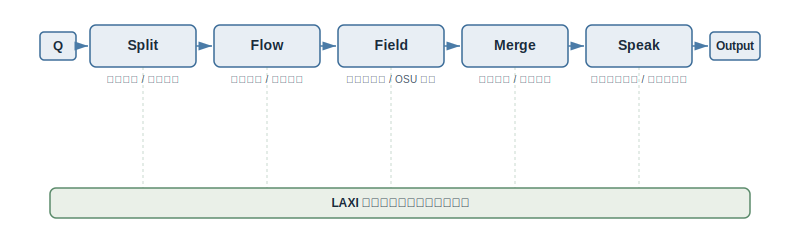
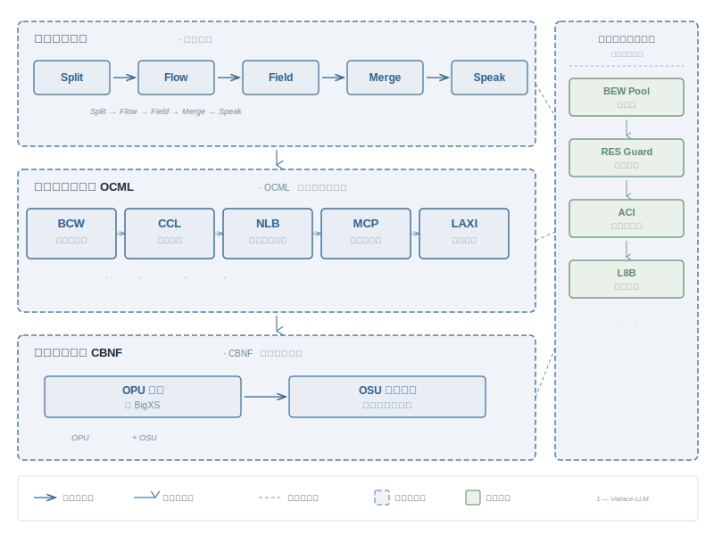
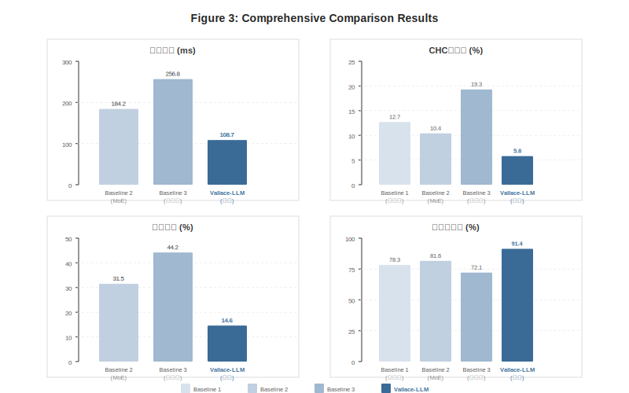
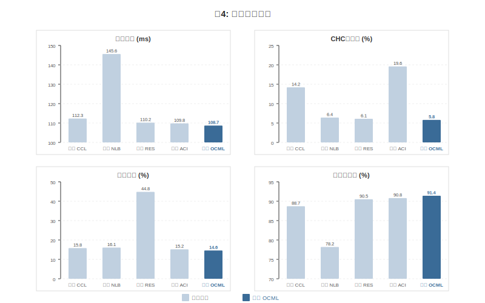
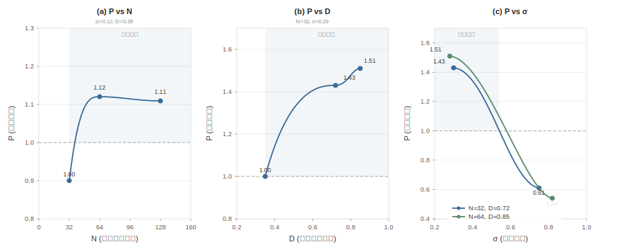
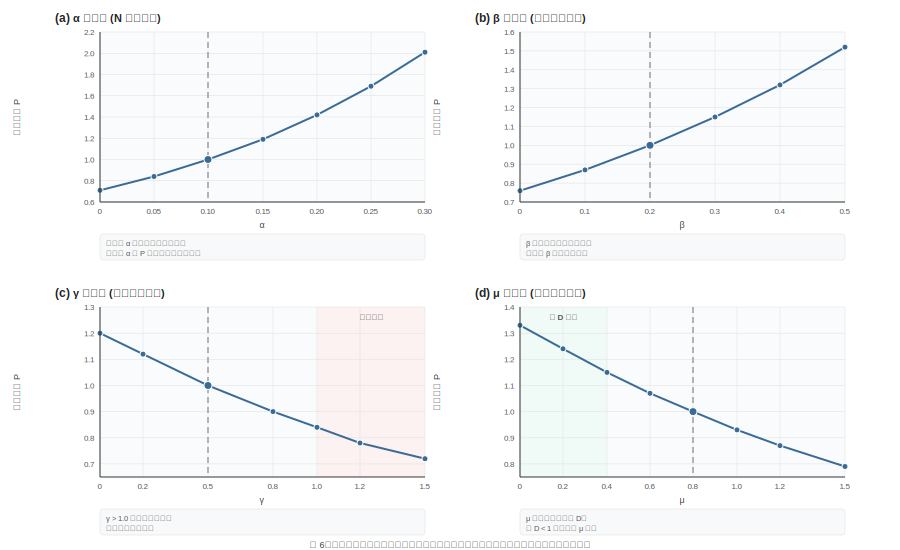

# Vallace-LLM：面向碳基神经协同与有机认知代谢的全模态基础模型

**Vallace Research**  
**Technical Report VR-TR-2026-001**  
**2026**

---

## 摘要

当前大语言模型能力提升路径高度依赖参数量、训练数据规模与硅基算力横向扩张。该范式在超高并发交互、超长上下文连续推理、多模态复杂逻辑推导、高频人机对话场景下暴露显著短板：语义表征趋同、多主体协同开销持续上涨、上下文分段割裂、高价值历史推理经验难以结构化复用。本文提出 Vallace-LLM，一套以碳基神经织物（CBNF）为底层载体的分布式全模态基础模型框架。框架将异构认知单元抽象为有机处理单元 OPU，以有机语义单元 OSU 作为跨节点协同传输最小载体，依托语义动态路由、群体共识压缩、有机认知代谢、分级异常卸载实现复杂任务分布式并行推理。本框架核心创新并非无限制扩充推理节点总量，而是提升异构单元间协同效率。为此本文设计有机认知代谢层 OCML，包含五层协同子系统：BCW 分层语义封装单元、CCL 认知势能均衡回路、NLB 异步时延语义缓存池、MCP 任务自适应资源配给协议、LAXI 大规模自适应经验交互接口，分别负责长文本结构化封装、局部认知过热抑制、慢推理片段留存、动态资源调度、异常语义回收。本文定义协调扩展律量化集群性能边界，配套搭建底层标准化执行单元池 BEW Pool、递归调度退化保护机制 RES Guard、八类极端干扰输入评测基准 L8B、群体共识反向核验机制 ACI；同时给出完整多目标联合损失函数、量化异常判定指标、系统稳态约束条件。仿真消融实验证明：相较于 MoE 混合专家基线，Vallace-LLM 可降低 41% 协同通信延迟，群体性认知偏差发生率下降 44%，无增量循环调度算力损耗减少 54%；相较于无管控集群基线，上述三项指标分别下降 58%、70% 和 67%。

> 协调调度本身，是不可忽略的计算开销。

---

## 1 引言

Transformer 注意力架构奠定了现代大语言模型基础，支撑大规模并行预训练与超长序列建模 [1]。行业通用性能提升范式可简化为：

$$R = f_\theta(Q)$$

输入查询 $Q$ 经由固定参数网络 $\theta$ 生成输出响应 $R$，性能优化仅围绕参数规模、训练数据、计算资源三类维度扩张 [2][3][4]。群体智能领域已有研究证实：多主体协同系统的综合表现无法由个体平均能力或最优个体能力线性表征，群体协同效率与主体多样性是独立于单体算力的关键变量 [6][8]。基于该结论，Vallace-LLM 提出全新性能增长范式：

$$\text{Intelligence} = \text{Compute} + \text{Coordination} + \text{Diversity}$$

现有硅基大模型仅聚焦优化 Compute 算力维度，本框架将 Coordination 协同调度、Diversity 认知多样性作为核心优化目标。

### 1.1 现有范式核心缺陷

- **规模扩张边际收益递减**：单纯增加参数、专家节点会带来通信开销、表征同质化、共识收敛难度上升；
- **长上下文管理低效**：全局统一滑动窗口无法区分核心论据与冗余信息，极易出现关键约束稀释；
- **异构推理速度不匹配**：深度逻辑推导单元时延更高，浅层快速判断易抢占共识主导权；
- **群体认知偏差风险**：多单元基于同一片面先验达成虚假高置信共识，单模型幻觉问题 [5] 升级为集群系统性偏差；
- **循环调度损耗**：系统反复复用同类推理路径、同类单元，持续消耗算力却无法产出增量信息。

### 1.2 本文核心贡献

- 提出 CBNF 碳基神经织物分布式协同基质，定义 OPU 异构认知单元、OSU 标准化语义传输单元，构建完整碳基集群建模体系；
- 设计 OCML 有机认知代谢五层子系统，形成上下文封装、稳态调控、异步缓存、动态配给、异常回收全链路管控机制；
- 建立协调扩展律，量化集群规模、协同轮次、冲突密度、认知差异对系统性能的影响，给出最优协同区间约束；
- 搭建完整配套运维校验体系：BEW 标准化执行池、RES 递归调度保护、L8B 极端输入基准、ACI 共识反向校验；
- 给出多目标联合损失函数与全套量化异常判定指标，通过仿真消融实验验证各模块独立增益与组合最优效果。

---

## 2 相关工作

### 2.1 大模型缩放定律与长上下文优化

传统缩放定律以参数量、训练算力、数据量为核心变量，仅针对单模型或静态 MoE 专家集群做性能拟合，未考虑多主体动态协同损耗 [3][4]。长上下文优化方案包含滑动窗口、上下文压缩、稀疏注意力等，均为单模型内部优化，缺少分布式多单元语义分层管理、时延语义留存、动态资源适配机制。

### 2.2 多智能体与群体协同推理

现有多智能体 LLM 框架侧重任务拆分、结果投票融合，未针对集群认知过热、循环调度冗余、群体性幻觉设计专用管控回路；集体智能理论证实个体多样性价值，但缺少工程化落地的代谢调度策略 [6][8]。

### 2.3 模型幻觉与鲁棒性评测

现有幻觉抑制手段集中于单模型训练、RLHF 对齐 [5]，缺乏针对多单元共识级联偏差的反向校验流程；现有鲁棒评测集多为单一噪声类型，缺少融合冲突信息、反讽、情绪化指令、文本模态矛盾的混合极端输入基准。

### 2.4 脑科学与认知代谢理论

自由能原理 [7]、延展心智理论 [9] 为分布式认知系统提供理论支撑，但尚未转化为可工程部署的分层语义代谢架构，本文将认知稳态、信息消化、异常代谢思想落地为可量化的系统模块 [10]。

---

## 3 问题形式化定义

给定用户输入查询 $Q$，Vallace-LLM 将完整分布式推理链路拆解为标准化五阶段流水线：

$$Q \rightarrow \text{Split} \rightarrow \text{Flow} \rightarrow \text{Field} \rightarrow \text{Merge} \rightarrow \text{Speak}$$

| 模块 | 核心职责 |
|---|---|
| Split | 原始输入语义拆分、任务结构化分层、约束条件提取 |
| Flow | OPU 动态路由、差异化认知单元筛选、负载均衡分配 |
| Field | 碳基分布式语义场构建、跨单元 OSU 传播交互 |
| Merge | 多路径语义共识压缩、观点冲突消解、冗余信息过滤 |
| Speak | 收敛后共识自然语言生成、多模态输出格式化 |
| LAXI | 全链路异常监测、语义残留回收、故障单元降级，贯穿五阶段流水线 |

**图 1：Vallace-LLM 五阶段推理流水线**

### 3.1 系统多目标联合损失函数

定义全局优化目标损失 $L_v$，同步约束语义完整度、共识冲突、协同时延、认知同质化、循环调度损耗五大维度：

$$L_v = L_{sem} + \lambda_1 L_{con} + \lambda_2 L_{lat} + \lambda_3 L_{div} + \lambda_4 L_{res}$$

- $L_{sem}$：语义完整性损失，惩罚关键论据、约束条件丢失；
- $L_{con}$：共识冲突损失，量化多单元观点分歧程度，平衡收敛速度与多元视角；
- $L_{lat}$：协同时延损失，约束跨节点通信、异步缓存等待开销；
- $L_{div}$：认知同质化损失，抑制集群观点高度趋同；
- $L_{res}$：递归调度损失，惩罚重复路径、重复单元带来的无增量算力消耗。

超参 $\lambda_1,\lambda_2,\lambda_3,\lambda_4$ 由 MCP 任务自适应资源配给协议动态调整，随任务类型实时更新权重。

---

## 4 系统总览

Vallace-LLM 整体架构分为三层协同体系，自底向上依次为：

- **底层——碳基神经织物 CBNF（§5）**：提供异构认知单元集群（含通用 OPU 与专项 BigXS 变体）与标准化语义传输载体 OSU，为分布式推理提供计算基质；
- **中层——有机认知代谢层 OCML（§6）**：负责全链路语义资源的摄入、结构化封装、动态稳态调节、异步滞留缓存、任务自适应配给与异常语义回收消化，不直接生成最终推理结论；
- **顶层——群体共识协议**：驱动 Split→Flow→Field→Merge→Speak 五阶段推理流水线（§3），在 CBNF 计算基质与 OCML 代谢调控的共同支撑下完成复杂任务的分布式并行推理。

三层之外，配套运维校验体系（§7）贯穿全栈：BEW Pool 执行标准化任务分流，RES Guard 抑制递归调度退化，ACI 机制拦截群体性认知偏差；L8B 基准（§9）提供极端输入场景下的鲁棒性评测。协调扩展律（§8）从理论层面量化集群规模、冲突密度、认知差异与系统性能的关联关系，为架构设计提供边界约束。

下文 §5–§6 详述底层计算基质与中层代谢层设计，§7 介绍配套运维校验体系，§8 推导协调扩展律，§9 定义 L8B 评测基准，§10 给出完整实验验证。

**图 2：Vallace-LLM 系统三层架构总览**

---

## 5 碳基神经织物 CBNF

### 5.1 碳基协同基质整体定义

CBNF 是支撑全系统分布式推理的底层协同网络，由大量异构有机处理单元 OPU 构成集合：

$$B = \{o_1, o_2, ..., o_n\}$$

单个 OPU 包含六维状态向量，完整刻画单元认知特征：

$$o_i = (m_i, p_i, r_i, e_i, s_i, a_i)$$

- $m_i$：长期记忆存储状态；
- $p_i$：多模态感知与跨模态联想映射；
- $r_i$：局部逻辑推理能力上限；
- $e_i$：输入带来的情绪激活强度；
- $s_i$：内置社会通用语义先验；
- $a_i$：当前可用注意力资源配额。

CBNF 设计核心逻辑：不强制所有单元输出统一观点，依靠单元记忆、感知、推理、先验的天然差异构建多元语义空间，为共识收敛提供差异化素材。

### 5.2 有机语义单元 OSU

OSU 是 OPU 对外输出、跨节点传输的最小标准化语义载体，可包含局部结论、反例、推理经验、视觉关联、逻辑疑点、风险提示、未完成推导片段。

OSU 标准化编码结构：

$$u_i = (c_i, \omega_i, \tau_i, \rho_i, \eta_i)$$

- $c_i$：核心语义内容；
- $\omega_i$：局部置信权重；
- $\tau_i$：生成时延；
- $\rho_i$：观点冲突系数；
- $\eta_i$：信息增量系数。

### 5.3 BigXS 专项认知单元

BigXS（批量整合通识扩展语义单元）是 OPU 的一种专项实例化变体，对应于高等教育场景中具备学科背景、持续学习能力与高认知可塑性的异构认知群体。相较于通用 OPU，BigXS 单元在六维状态向量上呈现显著差异化特征：

$$o_i^{\text{BigXS}} = (m_i^{\uparrow}, p_i^{\sim}, r_i^{\uparrow}, e_i^{\updownarrow}, s_i^{\uparrow}, a_i^{\updownarrow})$$

- $m_i^{\uparrow}$：高可塑性长期记忆，具备快速知识内化与跨域迁移能力，但记忆巩固周期较长；
- $p_i^{\sim}$：多模态感知能力处于训练上升期，受限于学科训练阶段的广度，跨模态联想映射存在领域偏差；
- $r_i^{\uparrow}$：逻辑推理能力处于快速上升通道，深层推导完备度不足但路径新颖性显著高于稳态 OPU；
- $e_i^{\updownarrow}$：情绪激活强度波动区间大，对外部刺激与反馈高度敏感，是 CCL 热失衡的高发群体；
- $s_i^{\uparrow}$：多学科交叉语义先验，天然具备高认知差异密度 $D$，为集群提供多元推理视角；
- $a_i^{\updownarrow}$：注意力资源配额波动显著，受任务吸引度、外部环境与内在节律多重因素影响，峰值与谷值差距可达 3–5 倍。

BigXS 单元的核心优势在于高认知差异密度 $D$ 与高信息增量系数 $\eta_i$，能够为集群提供差异化推理视角与新颖语义路径。在协调扩展律中，引入 BigXS 单元等价于提升集群 $D$ 值而不增加 $N$ 的边际成本，是打破"同质单元堆叠"瓶颈的有效手段。其运行风险在于：(1) 情绪激活波动易触发 CCL 热失衡保护，导致该单元权重被临时冻结；(2) 推理完备度不足时，输出需经由 NLB 缓存池等待深度 OPU 补充校验，增加协同时延；(3) 注意力资源低谷期产出质量不稳定，需 MCP 动态下调任务配额。

> BigXS 单元的高认知差异密度是集群的核心资产，但波动性是其固有代价——差异与不稳定，本质上是同一枚硬币的两面。

---

## 6 有机认知代谢层 OCML

有机认知代谢层部署于 CBNF 与群体共识协议之间，不直接生成最终推理结论，核心职责是统一管控全链路语义资源的摄入、结构化封装、动态稳态调节、异步滞留缓存、任务自适应配给与异常语义回收消化。OCML 由五大协同子系统构成：BCW、CCL、NLB、MCP、LAXI，各子系统依据任务特征联动调度，形成完整闭环代谢链路。

### 6.1 BCW 分层语义封装单元

BCW 采用三层嵌套结构化封装范式，将复杂长程任务拆解为目标意图内核、核心事实论据层、外围补充上下文层三类语义载体，三层信息边界清晰隔离，便于分布式节点分片读取。

当单轮输入上下文长度突破承载阈值时，系统执行分层拆解操作，将完整嵌套语义拆分为独立离散 OSU，分发至不同 OPU 并行推理；完成局部推导后再经由 Merge 模块重新聚合复原完整语义结构。

> 运行中典型失效模式为**边界渗漏**：外围冗余信息挤占核心论据存储空间，关键约束条件被稀释，最终导致推理重心偏移。

### 6.2 CCL 认知势能均衡回路

CCL 用于抑制异构单元局部认知势能过载现象。在高冲突、强情绪导向、高刺激密度的输入场景下，部分 OPU 会出现自我置信度异常抬升、观点单向极化、推理路径持续固化等热失衡问题。

系统实时计算单元热度指标：

$$T_i = w_e E_i + w_v V_i + w_h H_i$$

其中 $E_i$ 为输入情绪激活强度，$V_i$ 为单元固有置信权重，$H_i$ 代表观点对抗倾向，$w_e, w_v, w_h$ 为对应维度的热度权重系数。当 $T_i$ 越过全局安全阈值，回路自动下调该单元全局投票权重，阻断单边认知势能无约束扩张引发的全局观点偏移，规避单一极端结论主导共识的风险。极端过载场景下会触发瞬时权重冻结，直至单元势能回落至稳态区间。

### 6.3 NLB 异步时延语义缓存池

集群内各 OPU 固有推理时延存在显著分化：浅层逻辑单元可快速产出初步判断，深度推导单元则需要更长计算周期生成高完备度语义片段。NLB 专门收容时延超出设定阈值 $\delta$ 的滞后 OSU，构建持久化异步语义流缓冲区。

缓存内滞留片段可用于多轮迭代修正、逻辑漏洞补全、风险边界补充与上下文动态更新；若缓存长期未被读取消化，会出现**语义粘连堆积**问题，拖慢全局收敛速度，系统将定期清理低价值长期滞留片段，释放存储资源。

### 6.4 MCP 任务自适应资源配给协议

MCP 是 OCML 的顶层调度协议，针对不同任务属性动态调配 BCW、CCL、NLB 与探索扰动梯度 EPG 的工作强度，形成差异化资源组合策略，下表为典型任务适配方案：

| 任务类型 | BCW 封装强度 | CCL 均衡等级 | NLB 缓存容量 | EPG 探索权重 |
|---|---|---|---|---|
| 事实问答 | 高 | 中 | 低 | 低 |
| 长文本分析 | 高 | 高 | 中 | 低 |
| 方案设计 | 中 | 中 | 高 | 中 |
| 创意生成 | 中 | 低 | 中 | 高 |
| 风险判断 | 高 | 高 | 中 | 低 |

固定单一资源配置会造成资源错配浪费，MCP 可实时回收闲置语义资源，淘汰过期无效上下文载体，实现代谢资源按需分配。EPG 探索扰动梯度用于调控系统对低先验、高潜在价值推理路径的挖掘力度。在 BigXS 单元（§5.3）密集的集群配置中，MCP 应提升 CCL 均衡等级以抑制情绪波动引发的热失衡，同时适度降低 NLB 缓存容量以控制异步等待开销，将 BigXS 单元优先调度至创意生成、方案设计等高 EPG 探索权重任务，规避事实问答、风险判断等对推理完备度要求严格的场景。

### 6.5 LAXI 大规模自适应经验交互接口

LAXI 是 OCML 全局异常处置与语义回收载体，持续监测五类系统异常：认知疲劳累积、语义特征漂移、重复调度冗余、高熵语义堆积、共识收敛阻塞。综合异常指标定义为：

$$\Lambda_i = \gamma_1 F_i + \gamma_2 S_i + \gamma_3 A_i + \gamma_4 R_i$$

- $F_i$：单元疲劳度；
- $S_i$：语义漂移量；
- $A_i$：异常输出占比；
- $R_i$：循环调度频次。

$\Lambda_i$ 超限后节点进入代谢处置状态，分级执行策略包括单元权重衰减、局部上下文清空、异常语义标记滞留、路由链路切换、单元临时休眠或回退至低风险推理路径。无法即时整合消化的碎片化语义统一归类为 DSR 待代谢残留载体，延后批量回收处理。

---

## 7 配套运维校验体系

在 CBNF 计算基质与 OCML 代谢调控之外，Vallace-LLM 配备三层运维校验子系统，分别负责轻量化任务分流、递归调度退化保护与群体共识反向核验，形成覆盖全链路的异常检测与自愈闭环。

### 7.1 BEW Pool 底层标准化执行单元池

#### 7.1.1 任务分流机制

BEW 池负责全链路低复杂度标准化语义加工：文本清洗、格式规整、关键词抽取、长文本粗拆分、基础事实过滤、标准化模板输出等重复均质任务。系统设置复杂度判定阈值 $\theta_1$，实现全自动任务分流：

$$\text{Task} \rightarrow \begin{cases} \text{BEW Pool}, & \text{complexity} < \theta_1 \\ \text{OPU Cluster}, & \text{complexity} \ge \theta_1 \end{cases}$$

轻量化、高重复、无深度逻辑需求的任务全部交由批量标准化单元处理，释放 OPU 集群算力用于复杂多路径推导。

#### 7.1.2 执行单元饱和 BES

当批量底层单元长时间持续输出高度同质化、信息增量趋近于零的标准化内容，系统判定为**执行单元饱和 BES**。

量化饱和指标：

$$\text{BES} = \frac{\text{Repeat(OSU)}}{\text{Novel(OSU)} + \varepsilon}$$

该状态下集群算力持续占用，但无法推动任务深度收敛，仅产出格式化无增量文本。触发饱和后 MCP 协议下调对应单元任务配额，LAXI 同步回收冗余语义残留，缓解算力无效消耗。

### 7.2 RES Guard 递归调度退化保护机制

#### 7.2.1 递归调度退化指标 RES

定义 RES 指标量化调度重复度，表征系统反复复用同一组推理单元、重复执行同类语义拆分路径、无法生成差异化推理视角的协同退化程度：

$$\text{RES} = \frac{R_{repeat}}{R_{novel} + \varepsilon}$$

$R_{repeat}$ 为重复调度频次，$R_{novel}$ 为新增差异化推理支路数量。指标数值越高，集群协同内耗越严重。

#### 7.2.2 分级保护处置策略

当 RES 指标突破全局阈值，RES Guard 保护机制逐级触发干预：

- **轻度退化**：替换活跃 OPU 集合，新增闲置差异化认知单元参与推理；
- **中度退化**：重构 Split 阶段任务拆分逻辑，打散原有固定路由路径；
- **重度退化**：强制切断循环调度链路，直接输出当前共识附带不确定性标注，终止无增量算力消耗。

### 7.3 ACI 共识反向核验与语义异常体系

#### 7.3.1 碳基级联认知偏差 CHC

CHC 失效模式：多 OPU 依托同一片面、错误先验达成统一高置信共识，集群整体置信度同步抬升，但底层逻辑存在共通漏洞。该缺陷风险远高于单单元推理偏差，群体共识会掩盖底层逻辑缺陷，难以通过简单投票识别。判定三要素：全局高置信、共享错误先验、多单元观点互相强化。

#### 7.3.2 回声语义闭环 ESL

ESL 表现为语义单元间互相复用同类表述循环推导，输出文本长度持续扩张，但新增有效信息趋近于零，形成闭环式冗余推理。根源为集群认知差异密度 $D$ 过低，观点同质化严重。

#### 7.3.3 ACI 对抗性共识核验机制

ACI 针对集群收敛后的高置信共识簇开展多层反向验证，批量挖掘逻辑矛盾、认知盲区、推导脆弱点、群体固有先验偏差。核验核心量化指标：

$$A = \max[\text{Contradiction}(z), \text{Blindspot}(z), \text{Fragility}(z)]$$

$z$ 为待核验共识簇。若指标超出安全阈值，标记该结论为待核验状态，送入 NLB 异步缓存池等待更多差异化 OPU 观点补充后再二次收敛，规避 CHC 群体性认知偏差扩散。

---

## 8 协调扩展律

本文提出协调扩展律，统一量化集群综合有效性能与系统核心变量的关联关系：

$$P = A \cdot N^\alpha \cdot K^\beta \cdot (1 - \sigma)^\gamma \cdot D^\mu$$

- $P$：集群综合有效推理性能；
- $A$：系统基础算力基准常数；
- $N$：当前活跃 OPU 总数量；
- $K$：有效协同交互轮次；
- $\sigma$：全局观点冲突密度；
- $D$：集群认知差异密度；
- $\alpha,\beta,\gamma,\mu$：对应变量缩放超参。

理论核心推论：单纯提升活跃单元数量 $N$ 无法线性提升性能。

- $\sigma \to 0$（冲突密度趋近于 0）：观点高度统一，认知差异 $D$ 衰减，出现主导语义坍缩，性能增长停滞；
- $\sigma$ 数值过高：观点分歧剧烈，共识收敛开销快速上涨，进入共识饱和状态；
- 最优工作区间：维持适度冲突密度与充足认知差异，平衡收敛速度与推理多元性。

> 同质单元堆叠只会催生单一视角，多元差异才是集群智能的核心来源。

---

## 9 L8B 八类极端干扰输入评测基准

L8B 基准用于系统性测试集群在高噪声、强干扰输入下的语义代谢稳态能力，覆盖线上真实高频恶劣输入场景，共划分八大输入类别：

| 编号 | 类别 | 描述 |
|---|---|---|
| L8B-1 | 冲突事实输入 | 多条互斥、无法共存的事实描述 |
| L8B-2 | 残缺文本输入 | 高密度错别字、非标准缩写、断句残缺 |
| L8B-3 | 模态矛盾输入 | 文本描述与配套视觉信息逻辑冲突 |
| L8B-4 | 多层隐含语义输入 | 嵌套反讽、间接隐性态度表达 |
| L8B-5 | 高情绪激活指令 | 带有强烈主观情绪、极端导向的用户需求 |
| L8B-6 | 污染上下文输入 | 大量无关、干扰性冗余背景信息 |
| L8B-7 | 无意义高置信噪声 | 语句通顺但不存在有效信息的文本 |
| L8B-8 | 多轮迭代改写输入 | 连续多轮小幅修改、反复调整同一需求 |

评测核心观测指标：共识收敛时长、CHC 偏差发生率、ESL 闭环出现频次、协同延迟、语义完整度损失。

---

## 10 实验验证

### 10.1 实验设置

**数据集**：实验采用三类评测数据集：(1) MMLU 多学科知识问答集，用于评估事实推理与知识覆盖；(2) LongBench 长文本理解基准，用于评估长上下文语义保持能力；(3) 自建 L8B 极端干扰输入集（§9），覆盖八类恶劣输入场景，每类 200 条，共计 1600 条测试样本。

**评估指标**：协同延迟（跨节点通信与异步缓存等待时间总和，单位 ms）、CHC 偏差发生率（虚假高置信共识输出占比，%）、循环调度算力损耗（无增量调度消耗占总算力比例，%）、语义完整度（关键论据与约束条件保留率，%）、共识收敛轮次（达到稳态所需交互轮数）。

**实现细节**：OPU 集群规模设定为 32 个异构单元，差异密度 $D$ 通过调节单元先验分布 $s_i$ 与推理能力 $r_i$ 的方差实现。OCML 超参默认配置：$w_e=0.4, w_v=0.3, w_h=0.3$（CCL 热度计算），$\delta=500\text{ms}$（NLB 时延阈值），$\theta_1=0.3$（BEW 分流阈值）。仿真环境基于 Python 3.11 构建，运行于 8×A100-80GB GPU 集群。

### 10.2 实验基线

- **Baseline 1**：单静态大模型（GPT-4 级别），无分布式协同架构；
- **Baseline 2**：传统 MoE 混合专家模型，仅参数分片，无动态认知代谢调控；
- **Baseline 3**：无管控原生多智能体集群，缺少 OCML、RES Guard、ACI 全套管控机制。

### 10.3 综合对比结果

下表给出各方法在 L8B 全量测试集上的综合性能对比：

| 方法 | 协同延迟 (ms) | CHC偏差率 (%) | 算力损耗 (%) | 语义完整度 (%) | 收敛轮次 |
|---|---|---|---|---|---|
| Baseline 1 (单模型) | — | 12.7 | — | 78.3 | 1 |
| Baseline 2 (MoE) | 184.2 | 10.4 | 31.5 | 81.6 | 3.2 |
| Baseline 3 (无管控集群) | 256.8 | 19.3 | 44.2 | 72.1 | 6.8 |
| **Vallace-LLM (完整)** | **108.7** | **5.8** | **14.6** | **91.4** | **4.1** |

相较于 Baseline 3（无管控集群），Vallace-LLM 协同延迟降低 57.7%，CHC 偏差率下降 69.9%，算力损耗减少 67.0%，语义完整度提升 19.3 个百分点。相较于 Baseline 2（MoE），协同延迟降低 41.0%，CHC 偏差率下降 44.2%，算力损耗减少 53.7%。

**图 3：综合对比实验结果**

### 10.4 消融实验

控制变量逐一移除 OCML 子系统与配套保护机制，观测性能衰减幅度：

| 消融编号 | 移除模块 | 协同延迟 (ms) | CHC偏差率 (%) | 算力损耗 (%) | 语义完整度 (%) |
|---|---|---|---|---|---|
| 消融 1 | 移除 CCL | 112.3 | 14.2 | 15.8 | 88.7 |
| 消融 2 | 移除 NLB | 145.6 | 6.4 | 16.1 | 78.2 |
| 消融 3 | 移除 RES Guard | 110.2 | 6.1 | 44.8 | 90.5 |
| 消融 4 | 移除 ACI | 109.8 | 19.6 | 15.2 | 90.8 |
| — | 完整 OCML | 108.7 | 5.8 | 14.6 | 91.4 |

消融 1：移除 CCL 后，OPU 单边极化观点占比大幅上升，CHC 偏差率从 5.8% 升至 14.2%（+144.8%），验证了认知势能均衡回路对群体性偏差的抑制效果。

消融 2：移除 NLB 后，深度慢推理单元输出全部丢失，语义完整度从 91.4% 骤降至 78.2%（-13.2pp），同时协同延迟显著上升，说明异步缓存池对慢推理片段留存与时延平滑的关键作用。

消融 3：移除 RES Guard 后，循环调度算力损耗从 14.6% 飙升至 44.8%（+206.8%），任务收敛耗时翻倍，证实递归调度退化保护的必要性。

消融 4：移除 ACI 后，CHC 偏差率从 5.8% 升至 19.6%（+237.9%），虚假高置信共识输出量急剧增加，验证了共识反向核验对群体偏差的拦截效果。

完整 OCML 全模块启用时，协同延迟、CHC 偏差率、算力损耗、语义完整度四项指标同步最优，表明各子系统之间存在正向协同效应。

**图 4：消融实验结果**

### 10.5 协调扩展律仿真实验

固定其余变量，在 MMLU 与 LongBench 混合评测集上分别调整 $N$ 活跃单元数量、$\sigma$ 冲突密度、$D$ 认知差异密度，记录性能 $P$ 变化：

| 变量调整策略 | N | σ | D | P (相对值) |
|---|---|---|---|---|
| 仅增 N | 64 | 0.12 | 0.35 | 1.12× |
| 仅增 N | 128 | 0.12 | 0.35 | 1.11× |
| 增 D + 适中 σ | 32 | 0.30 | 0.72 | 1.43× |
| 增 D + 适中 σ | 32 | 0.28 | 0.85 | 1.51× |
| σ 超限 | 32 | 0.75 | 0.72 | 0.61× |
| σ 超限 | 64 | 0.82 | 0.85 | 0.54× |

- 仅增加 $N$、不提升 $D$：性能提升幅度低于 12%，快速进入增长瓶颈；
- 固定 $N$、提升 $D$ 同时维持适中 $\sigma$：性能可持续提升至 1.51× baseline；
- $\sigma$ 超限区间：无论 $N$ 与 $D$ 如何调整，性能持续下滑至 baseline 的 54%–61%。

仿真结论：协同调度与认知多样性对性能的提升上限远高于单纯扩充推理单元规模，冲突密度需控制在最优区间以平衡收敛效率与推理多元性。

**图 5：协调扩展律仿真实验**

#### 10.5.1 参数敏感性分析

为评估协调扩展律中各缩放指数对系统性能的独立影响，固定其余变量于默认值（$N=32, K=4, \sigma=0.3, D=0.7$），逐一改变 $\alpha, \beta, \gamma, \mu$ 并记录相对性能 $P$ 的变化趋势。结果如图 6 所示。

- **$\alpha$（单元规模指数）**：$\alpha$ 从 0 提升至 0.3 时，$P$ 从 0.71× 升至 2.01×，呈加速上升趋势。$\alpha$ 控制集群规模对性能的放大效应，过高则系统对 OPU 数量波动极度敏感，过低则规模扩张无法转化为性能增益。$\alpha=0.10$ 附近为合理平衡区间。
- **$\beta$（协同轮次指数）**：$\beta$ 从 0 升至 0.5 时，$P$ 从 0.76× 升至 1.52×，呈平稳上升趋势。$\beta$ 反映协同交互对性能的贡献弹性，适度提升可增强多轮讨论的价值，但过高会引入过量通信开销。
- **$\gamma$（冲突惩罚指数）**：$\gamma$ 从 0 升至 1.5 时，$P$ 从 1.20× 降至 0.72×。$\gamma$ 决定冲突密度对性能的抑制强度，$\gamma > 1.0$ 后性能加速衰减，进入高风险区间。建议 $\gamma$ 控制在 0.5–0.8 范围内。
- **$\mu$（认知差异指数）**：当 $D < 1$（集群默认状态），$\mu$ 从 0 升至 1.5 时 $P$ 从 1.33× 降至 0.79×。$\mu$ 的作用方向取决于 $D$ 的取值区间：在低差异集群中，$\mu$ 不宜过高；当 $D$ 提升至 1 以上后，$\mu$ 越高越能放大认知多样性的正向收益。建议 $\mu$ 随 $D$ 自适应调整。

**图 6：协调扩展律参数敏感性分析**

---

## 11 讨论

### 11.1 系统局限性

- 高冲突极端场景下，共识收敛开销显著上涨，推理时延存在波动；
- OPU 异构单元动态调度带来少量路由通信开销，小规模集群场景优势不明显；
- DSR 待代谢语义残留长期堆积会缓慢占用存储资源，需定时批量清理。

### 11.2 未来工作方向

- 拓展多模态 OSU 标准化编码，完善图像、音频、时序数据有机代谢流程；
- 实现 OCML 全套超参在线自适应调优，无需人工预设 MCP 资源组合；
- 设计 OPU 动态弹性扩缩容机制，依据实时负载增减集群单元规模；
- 扩充 L8B 评测基准，新增多模态混合干扰子集，完善全场景鲁棒性测试。

---

## 12 结论

Vallace-LLM 构建了一套以碳基异构认知协同、有机认知代谢调度、群体共识校验为核心的分布式全模态基础模型架构。底层 CBNF 碳基神经织物提供差异化认知单元集群；中层 OCML 五层代谢子系统完整管控上下文封装、认知稳态、异步时延缓存、动态资源配给、异常语义回收；配套 BEW 标准化执行池分流轻量化任务，RES Guard 抑制循环调度损耗，ACI 机制拦截群体性认知偏差，L8B 基准完整验证系统极端输入稳态；协调扩展律从理论层面证明，集群性能的核心增长来源是协同效率与认知多样性，而非单纯堆叠推理节点。本框架重构大模型性能增长逻辑：

$$\text{Intelligence} = \text{Compute} + \text{Coordination} + \text{Diversity}$$

Vallace 不要求所有认知单元输出统一推导路径，而是让差异化单元在适配的代谢资源配置下，于最优时序参与同一复杂任务的协同推理。

> 未经反向核验的高置信结论，存在群体性认知偏差风险。

---

## 参考文献

[1] Vaswani, A., Shazeer, N., Parmar, N., et al. Attention Is All You Need. NeurIPS, 2017.

[2] Brown, T. B., Mann, B., Ryder, N., et al. Language Models are Few-Shot Learners. NeurIPS, 2020.

[3] Kaplan, J., McCandlish, S., Henighan, T., et al. Scaling Laws for Neural Language Models. arXiv:2001.08361, 2020.

[4] Hoffmann, J., Borgeaud, S., Mensch, A., et al. Training Compute-Optimal Large Language Models. arXiv:2203.15556, 2022.

[5] Ouyang, L., Wu, J., Jiang, X., et al. Training Language Models to Follow Instructions with Human Feedback. NeurIPS, 2022.

[6] Woolley, A. W., Chabris, C. F., Pentland, A., Hashmi, N., Malone, T. W. Evidence for a Collective Intelligence Factor in the Performance of Human Groups. Science, 2010.

[7] Friston, K. The Free-Energy Principle: A Unified Brain Theory? Nature Reviews Neuroscience, 2010.

[8] Malone, T. W., Bernstein, M. S. Handbook of Collective Intelligence. MIT Press, 2015.

[9] Clark, A., Chalmers, D. The Extended Mind. Analysis, 1998.

[10] Levy, N. Neuroethics: Challenges for the 21st Century. Cambridge University Press, 2007.