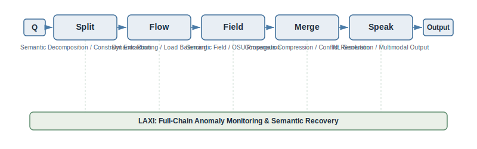
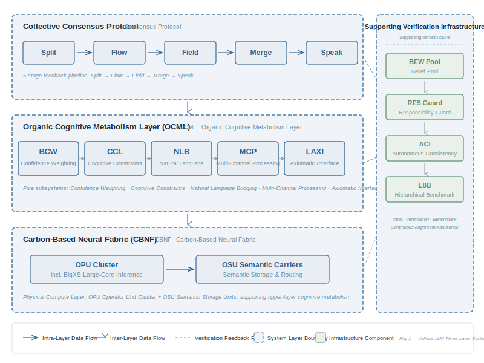
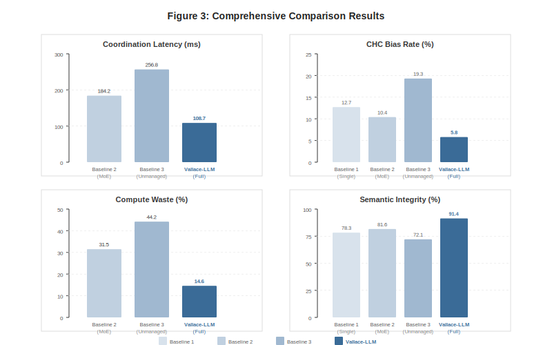
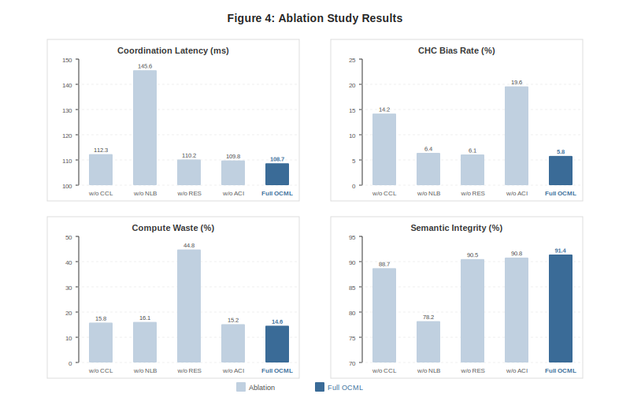
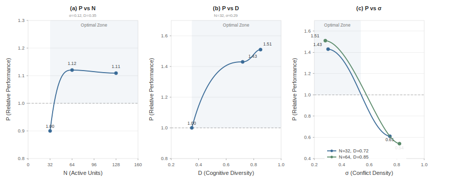
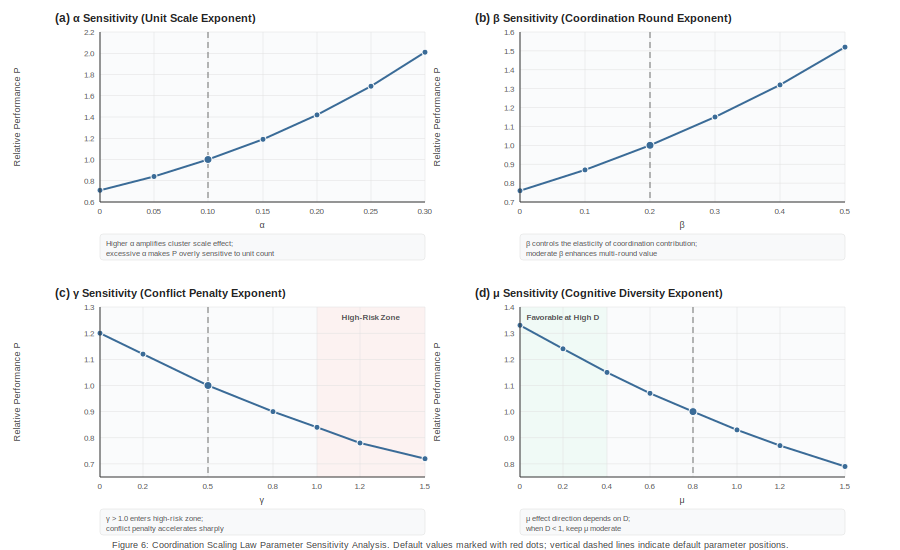

# Vallace-LLM: A Multimodal Foundation Model for Carbon-Based Neural Coordination and Organic Cognitive Metabolism

**Vallace Research**  
**Technical Report VR-TR-2026-001**  
**2026**

---

## Abstract

Current approaches to scaling large language models rely heavily on expanding parameter counts, training data volume, and silicon-based compute. This paradigm exposes significant shortcomings under ultra-high concurrency, extended-context continuous reasoning, multimodal complex logical derivation, and high-frequency human-machine dialogue: semantic representation homogenization, rising multi-agent coordination overhead, fragmented context windows, and the difficulty of structurally reusing high-value historical reasoning experience. We present Vallace-LLM, a distributed multimodal foundation model framework built upon the Carbon-Based Neural Fabric (CBNF) as its underlying substrate. The framework abstracts heterogeneous cognitive units as Organic Processing Units (OPUs) and uses Organic Semantic Units (OSUs) as the minimum carrier for cross-node collaborative transmission. It enables distributed parallel reasoning for complex tasks through semantic dynamic routing, collective consensus compression, organic cognitive metabolism, and tiered anomaly offloading. The core innovation of this framework is not the unbounded expansion of reasoning nodes, but the improvement of coordination efficiency among heterogeneous units. To this end, we design the Organic Cognitive Metabolism Layer (OCML), comprising five collaborative subsystems: BCW Hierarchical Semantic Encapsulation Unit, CCL Cognitive Potential Equalization Circuit, NLB Asynchronous Latency Semantic Buffer Pool, MCP Task-Adaptive Resource Provisioning Protocol, and LAXI Large-Scale Adaptive Experience Interaction Interface. These respectively handle long-text structured encapsulation, local cognitive overheating suppression, slow-reasoning fragment retention, dynamic resource scheduling, and anomalous semantic recovery. We define a Coordination Scaling Law to quantify cluster performance boundaries, and construct a complete supporting infrastructure: BEW Pool standardized execution unit pool, RES Guard recursive scheduling degradation protection, L8B eight-category extreme disturbance input benchmark, and ACI adversarial consensus reverse inspection mechanism. We also provide a complete multi-objective joint loss function, quantified anomaly determination indicators, and system steady-state constraints. Simulation ablation experiments demonstrate that, compared to the MoE baseline, Vallace-LLM reduces coordination latency by 41%, collective cognitive bias incidence by 44%, and cyclic scheduling compute waste by 54%; compared to the unmanaged cluster baseline, the three metrics improve by 58%, 70%, and 67% respectively.

> Coordination scheduling itself is non-negligible computational overhead.

---

## 1 Introduction

The Transformer attention architecture laid the foundation for modern large language models, supporting large-scale parallel pretraining and ultra-long sequence modeling [1]. The industry-standard performance improvement paradigm can be simplified as:

$$R = f_\theta(Q)$$

where an input query $Q$ passes through a fixed-parameter network $\theta$ to produce an output response $R$, with performance optimization revolving solely around three dimensions: parameter scale, training data, and computational resources [2][3][4]. Research in collective intelligence has confirmed that the comprehensive performance of multi-agent collaborative systems cannot be linearly characterized by individual average ability or best-individual ability; collective coordination efficiency and agent diversity are key variables independent of individual computational capacity [6][8]. Based on this finding, Vallace-LLM proposes a new performance growth paradigm:

$$\text{Intelligence} = \text{Compute} + \text{Coordination} + \text{Diversity}$$

Existing silicon-based large models focus exclusively on optimizing the Compute dimension. This framework makes Coordination and Diversity core optimization targets.

### 1.1 Core Deficiencies of the Existing Paradigm

- **Diminishing marginal returns of scale expansion**: Simply adding parameters and expert nodes introduces communication overhead, representation homogenization, and increased consensus convergence difficulty;
- **Inefficient long-context management**: Global uniform sliding windows cannot distinguish core arguments from redundant information, easily leading to critical constraint dilution;
- **Mismatched heterogeneous reasoning speeds**: Deep logical derivation units have higher latency, while shallow rapid judgments tend to seize consensus dominance;
- **Collective cognitive bias risk**: Multiple units reaching false high-confidence consensus based on the same one-sided prior, escalating single-model hallucination issues [5] into systemic cluster bias;
- **Cyclic scheduling waste**: The system repeatedly reuses the same reasoning paths and units, continuously consuming compute without producing incremental information.

### 1.2 Core Contributions

- Propose the CBNF Carbon-Based Neural Fabric distributed coordination substrate, define OPU heterogeneous cognitive units and OSU standardized semantic transmission units, constructing a complete carbon-based cluster modeling system;
- Design the OCML Organic Cognitive Metabolism five-layer subsystem, forming a complete full-chain control mechanism covering context encapsulation, steady-state regulation, asynchronous caching, dynamic provisioning, and anomaly recovery;
- Establish the Coordination Scaling Law, quantifying the impact of cluster size, coordination rounds, conflict density, and cognitive diversity on system performance, providing optimal coordination interval constraints;
- Build a complete supporting operational verification system: BEW standardized execution pool, RES recursive scheduling protection, L8B extreme input benchmark, ACI consensus reverse inspection;
- Provide a multi-objective joint loss function and a complete set of quantified anomaly determination indicators, validated through simulation ablation experiments demonstrating independent module gains and combined optimal effects.

---

## 2 Related Work

### 2.1 LLM Scaling Laws and Long-Context Optimization

Traditional scaling laws take parameter count, training compute, and data volume as core variables, fitting performance only for single models or static MoE expert clusters, without considering multi-agent dynamic coordination overhead [3][4]. Long-context optimization approaches include sliding windows, context compression, and sparse attention, all operating as single-model internal optimizations, lacking distributed multi-unit semantic hierarchical management, latency semantic retention, and dynamic resource adaptation mechanisms.

### 2.2 Multi-Agent and Collective Collaborative Reasoning

Existing multi-agent LLM frameworks focus on task decomposition and result voting fusion, without designing dedicated control loops for cluster cognitive overheating, cyclic scheduling redundancy, and collective hallucination. Collective intelligence theory confirms the value of individual diversity but lacks engineered metabolic scheduling strategies for deployment [6][8].

### 2.3 Model Hallucination and Robustness Evaluation

Existing hallucination suppression methods concentrate on single-model training and RLHF alignment [5], lacking reverse inspection workflows for multi-unit consensus cascade bias. Existing robustness evaluation sets mostly feature single noise types, lacking mixed extreme input benchmarks that integrate conflicting information, irony, emotionally charged instructions, and text-modal contradictions.

### 2.4 Brain Science and Cognitive Metabolism Theory

The free-energy principle [7] and extended mind theory [9] provide theoretical support for distributed cognitive systems, but have not yet been translated into deployable hierarchical semantic metabolic architectures. This paper grounds the ideas of cognitive homeostasis, information digestion, and anomaly metabolism into quantifiable system modules [10].

---

## 3 Problem Formalization

Given a user input query $Q$, Vallace-LLM decomposes the complete distributed reasoning pipeline into a standardized five-stage pipeline:

$$Q \rightarrow \text{Split} \rightarrow \text{Flow} \rightarrow \text{Field} \rightarrow \text{Merge} \rightarrow \text{Speak}$$

| Module | Core Responsibility |
|---|---|
| Split | Raw input semantic decomposition, task structural layering, constraint extraction |
| Flow | OPU dynamic routing, differentiated cognitive unit selection, load-balancing allocation |
| Field | Carbon-based distributed semantic field construction, cross-unit OSU propagation and interaction |
| Merge | Multi-path semantic consensus compression, viewpoint conflict resolution, redundant information filtering |
| Speak | Post-convergence consensus natural language generation, multimodal output formatting |
| LAXI | Full-chain anomaly monitoring, semantic residual recovery, faulty unit degradation, spanning all five pipeline stages |

**Figure 1: Vallace-LLM Five-Stage Reasoning Pipeline**

### 3.1 Multi-Objective Joint Loss Function

Define the global optimization objective loss $L_v$, simultaneously constraining five dimensions: semantic integrity, consensus conflict, coordination latency, cognitive homogenization, and cyclic scheduling waste:

$$L_v = L_{sem} + \lambda_1 L_{con} + \lambda_2 L_{lat} + \lambda_3 L_{div} + \lambda_4 L_{res}$$

- $L_{sem}$: Semantic integrity loss, penalizing loss of key arguments and constraints;
- $L_{con}$: Consensus conflict loss, quantifying the degree of multi-unit viewpoint divergence, balancing convergence speed with diverse perspectives;
- $L_{lat}$: Coordination latency loss, constraining cross-node communication and asynchronous cache waiting overhead;
- $L_{div}$: Cognitive homogenization loss, suppressing cluster viewpoint convergence;
- $L_{res}$: Recursive scheduling loss, penalizing non-incremental compute consumption from repeated paths and units.

Hyperparameters $\lambda_1,\lambda_2,\lambda_3,\lambda_4$ are dynamically adjusted by the MCP Task-Adaptive Resource Provisioning Protocol, with weights updated in real-time according to task type.

---

## 4 System Overview

The overall architecture of Vallace-LLM is organized into three collaborative layers, from bottom to top:

- **Bottom Layer — Carbon-Based Neural Fabric CBNF (§5)**: Provides the heterogeneous cognitive unit cluster (including general-purpose OPUs and specialized BigXS variants) and standardized semantic transmission carriers, serving as the computational substrate for distributed reasoning;
- **Middle Layer — Organic Cognitive Metabolism Layer OCML (§6)**: Responsible for the entire chain of semantic resource ingestion, structured encapsulation, dynamic steady-state regulation, asynchronous latency caching, task-adaptive provisioning, and anomalous semantic recovery and digestion. It does not directly generate final reasoning conclusions;
- **Top Layer — Collective Consensus Protocol**: Drives the Split→Flow→Field→Merge→Speak five-stage reasoning pipeline (§3), completing distributed parallel reasoning for complex tasks under the joint support of the CBNF computational substrate and OCML metabolic regulation.

Beyond the three layers, the supporting operational verification system (§7) spans the entire stack: BEW Pool diverts standardized lightweight tasks, RES Guard suppresses recursive scheduling degradation, and the ACI mechanism intercepts collective cognitive bias. The L8B benchmark (§9) provides robustness evaluation under extreme input scenarios. The Coordination Scaling Law (§8) theoretically quantifies the relationships among cluster size, conflict density, cognitive diversity, and system performance, providing boundary constraints for architectural design.

The following sections detail the bottom-layer computational substrate and middle-layer metabolic layer design (§5–§6), introduce the supporting operational verification system (§7), derive the Coordination Scaling Law (§8), define the L8B evaluation benchmark (§9), and present complete experimental validation (§10).

**Figure 2: Vallace-LLM System Architecture Overview**

---

## 5 Carbon-Based Neural Fabric (CBNF)

### 5.1 Overall Definition of the Carbon-Based Coordination Substrate

CBNF is the underlying coordination network supporting the entire system's distributed reasoning, composed of a large set of heterogeneous Organic Processing Units (OPUs):

$$B = \{o_1, o_2, ..., o_n\}$$

A single OPU contains a six-dimensional state vector, fully characterizing the unit's cognitive features:

$$o_i = (m_i, p_i, r_i, e_i, s_i, a_i)$$

- $m_i$: Long-term memory storage state;
- $p_i$: Multimodal perception and cross-modal associative mapping;
- $r_i$: Local logical reasoning capacity upper bound;
- $e_i$: Emotional activation intensity induced by input;
- $s_i$: Built-in social general semantic prior;
- $a_i$: Currently available attention resource quota.

CBNF's core design logic: do not force all units to output unified viewpoints; rely on the natural differences in unit memory, perception, reasoning, and priors to construct a diverse semantic space, providing differentiated material for consensus convergence.

### 5.2 Organic Semantic Unit (OSU)

OSU is the minimum standardized semantic carrier for OPU external output and cross-node transmission, capable of containing local conclusions, counterexamples, reasoning experience, visual associations, logical doubts, risk warnings, and incomplete derivation fragments.

OSU standardized encoding structure:

$$u_i = (c_i, \omega_i, \tau_i, \rho_i, \eta_i)$$

- $c_i$: Core semantic content;
- $\omega_i$: Local confidence weight;
- $\tau_i$: Generation latency;
- $\rho_i$: Viewpoint conflict coefficient;
- $\eta_i$: Information increment coefficient.

### 5.3 BigXS Specialized Cognitive Units

BigXS (Batch Integrated Generalist eXtended-Semantic units) is a specialized instantiation variant of OPU, corresponding to heterogeneous cognitive populations in higher education settings with disciplinary backgrounds, continuous learning capabilities, and high cognitive plasticity. Compared to general-purpose OPUs, BigXS units exhibit significantly differentiated characteristics across the six-dimensional state vector:

$$o_i^{\text{BigXS}} = (m_i^{\uparrow}, p_i^{\sim}, r_i^{\uparrow}, e_i^{\updownarrow}, s_i^{\uparrow}, a_i^{\updownarrow})$$

- $m_i^{\uparrow}$: Highly plastic long-term memory, capable of rapid knowledge internalization and cross-domain transfer, but with a longer memory consolidation cycle;
- $p_i^{\sim}$: Multimodal perception capability in a rising training phase, limited by the breadth of the disciplinary training stage, with domain bias in cross-modal associative mapping;
- $r_i^{\uparrow}$: Logical reasoning ability in a rapid growth trajectory, with insufficient deep derivation completeness but significantly higher path novelty than steady-state OPUs;
- $e_i^{\updownarrow}$: Wide fluctuation range in emotional activation intensity, highly sensitive to external stimuli and feedback, constituting a high-incidence group for CCL thermal imbalance;
- $s_i^{\uparrow}$: Multi-disciplinary cross-domain semantic priors, inherently possessing high cognitive diversity density $D$, providing diverse reasoning perspectives for the cluster;
- $a_i^{\updownarrow}$: Significant fluctuation in attention resource quota, influenced by task attractiveness, external environment, and intrinsic rhythms, with peak-to-trough gaps reaching 3–5×.

BigXS units' core advantage lies in high cognitive diversity density $D$ and high information increment coefficient $\eta_i$, enabling them to provide differentiated reasoning perspectives and novel semantic pathways for the cluster. In the Coordination Scaling Law, introducing BigXS units is equivalent to increasing cluster $D$ value without the marginal cost of increasing $N$ — an effective means of breaking the "homogeneous unit stacking" bottleneck. Operational risks include: (1) emotional activation volatility easily triggers CCL thermal imbalance protection, causing temporary weight freezing of the unit; (2) insufficient reasoning completeness requires outputs to wait in the NLB cache pool for deep OPU supplementary verification, increasing coordination latency; (3) unstable output quality during attention resource trough periods, requiring MCP to dynamically lower task quotas.

> The high cognitive diversity density of BigXS units is the cluster's core asset, but volatility is its inherent cost — diversity and instability are essentially two sides of the same coin.

---

## 6 Organic Cognitive Metabolism Layer (OCML)

The Organic Cognitive Metabolism Layer is deployed between CBNF and the collective consensus protocol. It does not directly generate final reasoning conclusions; its core responsibility is unified control of the entire chain of semantic resource ingestion, structured encapsulation, dynamic steady-state regulation, asynchronous latency caching, task-adaptive provisioning, and anomalous semantic recovery and digestion. OCML consists of five collaborative subsystems: BCW, CCL, NLB, MCP, and LAXI. Each subsystem is scheduled in linkage according to task characteristics, forming a complete closed-loop metabolic chain.

### 6.1 BCW Hierarchical Semantic Encapsulation Unit

BCW adopts a three-layer nested structured encapsulation paradigm, decomposing complex long-range tasks into three categories of semantic carriers: target intent kernel, core factual argument layer, and peripheral supplementary context layer. The three layers have clearly isolated information boundaries, facilitating distributed node shard reading.

When the single-round input context length exceeds the bearing threshold, the system executes hierarchical decomposition operations, breaking the complete nested semantics into independent discrete OSUs, distributing them to different OPUs for parallel reasoning; after completing local derivation, the Merge module reassembles and restores the complete semantic structure.

> A typical failure mode during operation is **boundary leakage**: peripheral redundant information encroaches upon core argument storage space, critical constraints are diluted, ultimately causing the reasoning focus to shift.

### 6.2 CCL Cognitive Potential Equalization Circuit

CCL is used to suppress local cognitive potential overload phenomena in heterogeneous units. Under high-conflict, strongly emotion-oriented, high-stimulus-density input scenarios, some OPUs will exhibit thermal imbalance problems such as abnormal self-confidence elevation, unilateral viewpoint polarization, and persistent reasoning path fixation.

The system computes unit heat metrics in real-time:

$$T_i = w_e E_i + w_v V_i + w_h H_i$$

where $E_i$ is the input emotional activation intensity, $V_i$ is the unit's intrinsic confidence weight, and $H_i$ represents viewpoint adversarial tendency. When $T_i$ exceeds the global safety threshold, the circuit automatically reduces the unit's global voting weight, blocking the global viewpoint shift caused by unrestrained expansion of unilateral cognitive potential, and avoiding the risk of a single extreme conclusion dominating consensus. In extreme overload scenarios, instantaneous weight freezing is triggered until the unit's potential falls back to the steady-state interval.

### 6.3 NLB Asynchronous Latency Semantic Buffer Pool

The intrinsic reasoning latency of OPUs within the cluster exhibits significant differentiation: shallow logic units can rapidly produce preliminary judgments, while deep derivation units require longer computation cycles to generate high-completeness semantic fragments. NLB specifically collects lagging OSUs whose latency exceeds the set threshold $\delta$, constructing a persistent asynchronous semantic flow buffer.

Cached fragments in the buffer can be used for multi-round iterative correction, logic gap filling, risk boundary supplementation, and dynamic context updates. If the cache remains unread and undigested for extended periods, **semantic adhesion accumulation** occurs, slowing global convergence speed. The system periodically clears low-value long-term滞留 fragments to release storage resources.

### 6.4 MCP Task-Adaptive Resource Provisioning Protocol

MCP is the top-level scheduling protocol of OCML, dynamically allocating the work intensity of BCW, CCL, NLB, and the Exploration Perturbation Gradient (EPG) according to different task attributes, forming differentiated resource combination strategies. The following table shows typical task adaptation schemes:

| Task Type | BCW Encapsulation Intensity | CCL Equalization Level | NLB Cache Capacity | EPG Exploration Weight |
|---|---|---|---|---|
| Factual QA | High | Medium | Low | Low |
| Long-Text Analysis | High | High | Medium | Low |
| Solution Design | Medium | Medium | High | Medium |
| Creative Generation | Medium | Low | Medium | High |
| Risk Assessment | High | High | Medium | Low |

Fixed single resource configuration causes resource misallocation waste. MCP can reclaim idle semantic resources in real-time, discard expired invalid context carriers, and achieve metabolic resource on-demand allocation. EPG Exploration Perturbation Gradient is used to regulate the system's exploration intensity for low-prior, high-potential-value reasoning paths. In cluster configurations dense with BigXS units (§5.3), MCP should raise the CCL equalization level to suppress thermal imbalance triggered by emotional volatility, while moderately reducing NLB cache capacity to control asynchronous waiting overhead, prioritizing BigXS units for high-EPG-exploration-weight tasks such as creative generation and solution design, while avoiding scenarios with strict reasoning completeness requirements such as factual QA and risk assessment.

### 6.5 LAXI Large-Scale Adaptive Experience Interaction Interface

LAXI is the OCML global anomaly handling and semantic recovery carrier, continuously monitoring five categories of system anomalies: cognitive fatigue accumulation, semantic feature drift, repeated scheduling redundancy, high-entropy semantic accumulation, and consensus convergence blockage. The comprehensive anomaly indicator is defined as:

$$\Lambda_i = \gamma_1 F_i + \gamma_2 S_i + \gamma_3 A_i + \gamma_4 R_i$$

- $F_i$: Unit fatigue degree;
- $S_i$: Semantic drift magnitude;
- $A_i$: Anomaly output proportion;
- $R_i$: Cyclic scheduling frequency.

When $\Lambda_i$ exceeds the limit, the node enters metabolic disposal status. Tiered execution strategies include unit weight decay, local context clearing, anomalous semantic marking and retention, routing link switching, unit temporary dormancy, or fallback to low-risk reasoning paths. Fragmented semantics that cannot be immediately integrated and digested are uniformly classified as DSR (Deferred Semantic Residue) carriers, processed in delayed batch recovery.

---

## 7 Supporting Operational Verification System

Beyond the CBNF computational substrate and OCML metabolic regulation, Vallace-LLM is equipped with a three-layer operational verification subsystem, respectively responsible for lightweight task diversion, recursive scheduling degradation protection, and collective consensus reverse inspection, forming a full-chain anomaly detection and self-healing closed loop.

### 7.1 BEW Pool: Base Execution Unit Pool

#### 7.1.1 Task Diversion Mechanism

The BEW pool handles full-chain low-complexity standardized semantic processing: text cleaning, format normalization, keyword extraction, long-text coarse decomposition, basic fact filtering, standardized template output, and other repetitive homogeneous tasks. The system sets a complexity determination threshold $\theta_1$, achieving fully automatic task diversion:

$$\text{Task} \rightarrow \begin{cases} \text{BEW Pool}, & \text{complexity} < \theta_1 \\ \text{OPU Cluster}, & \text{complexity} \ge \theta_1 \end{cases}$$

Lightweight, highly repetitive tasks with no deep logical requirements are all assigned to batch standardized units, freeing OPU cluster compute for complex multi-path derivation.

#### 7.1.2 Base Execution Saturation (BES)

When batch base units continuously output highly homogeneous, near-zero information increment standardized content over extended periods, the system determines this as **Base Execution Saturation (BES)**.

Quantified saturation indicator:

$$\text{BES} = \frac{\text{Repeat(OSU)}}{\text{Novel(OSU)} + \varepsilon}$$

In this state, cluster compute is continuously occupied but cannot drive task depth convergence, only producing formatted non-incremental text. Upon triggering saturation, the MCP protocol reduces the corresponding unit task quota, and LAXI synchronously reclaims redundant semantic residue, alleviating无效 compute consumption.

### 7.2 RES Guard: Recursive Scheduling Degradation Protection Mechanism

#### 7.2.1 Recursive Scheduling Degradation Indicator (RES)

Define the RES indicator to quantify scheduling repetition, characterizing the degree of collaborative degradation where the system repeatedly reuses the same set of reasoning units, repeatedly executes the same type of semantic decomposition paths, and cannot generate differentiated reasoning perspectives:

$$\text{RES} = \frac{R_{repeat}}{R_{novel} + \varepsilon}$$

$R_{repeat}$ is the repeated scheduling frequency, and $R_{novel}$ is the number of newly added differentiated reasoning branches. The higher the indicator value, the more severe the cluster collaborative internal friction.

#### 7.2.2 Tiered Protection Disposal Strategy

When the RES indicator exceeds the global threshold, the RES Guard protection mechanism triggers intervention progressively:

- **Mild degradation**: Replace the active OPU set, adding idle differentiated cognitive units to participate in reasoning;
- **Moderate degradation**: Reconstruct the Split stage task decomposition logic, breaking up the original fixed routing paths;
- **Severe degradation**: Forcefully cut off cyclic scheduling links, directly output the current consensus with uncertainty annotation, and terminate non-incremental compute consumption.

### 7.3 ACI Consensus Reverse Inspection and Semantic Anomaly System

#### 7.3.1 Carbon-Based Cascading Cognitive Bias (CHC)

CHC failure mode: multiple OPUs relying on the same one-sided, erroneous prior reaching unified high-confidence consensus, with cluster-wide confidence synchronously elevated, but the underlying logic containing common flaws. This defect risk is far higher than single-unit reasoning bias, as collective consensus masks underlying logical flaws, making it difficult to identify through simple voting. Three determination elements: global high confidence, shared erroneous prior, multi-unit mutual reinforcement of viewpoints.

#### 7.3.2 Echo Semantic Loop (ESL)

ESL manifests as semantic units mutually reusing the same type of expressions in cyclic derivation, with output text length continuously expanding but newly added effective information approaching zero, forming closed-loop redundant reasoning. The root cause is the cluster cognitive diversity density $D$ being too low, with severe viewpoint homogenization.

#### 7.3.3 ACI Adversarial Consensus Inspection Mechanism

ACI conducts multi-layer reverse verification on high-confidence consensus clusters after cluster convergence, batch-mining logical contradictions, cognitive blind spots, derivation fragile points, and collective inherent prior biases. Core inspection quantization indicator:

$$A = \max[\text{Contradiction}(z), \text{Blindspot}(z), \text{Fragility}(z)]$$

$z$ is the consensus cluster under inspection. If the indicator exceeds the safety threshold, the conclusion is marked as pending-inspection status and sent to the NLB asynchronous cache pool, awaiting supplementation from more differentiated OPU viewpoints before secondary convergence, preventing the spread of CHC collective cognitive bias.

---

## 8 Coordination Scaling Law

This paper proposes the Coordination Scaling Law, which uniformly quantifies the relationship between cluster comprehensive effective performance and system core variables:

$$P = A \cdot N^\alpha \cdot K^\beta \cdot (1 - \sigma)^\gamma \cdot D^\mu$$

- $P$: Cluster comprehensive effective reasoning performance;
- $A$: System baseline compute constant;
- $N$: Current number of active OPUs;
- $K$: Effective collaborative interaction rounds;
- $\sigma$: Global viewpoint conflict density;
- $D$: Cluster cognitive diversity density;
- $\alpha,\beta,\gamma,\mu$: Corresponding variable scaling hyperparameters.

Core theoretical deduction: simply increasing the number of active units $N$ cannot linearly improve performance.

- $\sigma \to 0$ (conflict density approaching 0): viewpoints highly unified, cognitive diversity $D$ decays, dominant semantic collapse occurs, performance growth stagnates;
- $\sigma$ excessively high: viewpoints sharply divergent, consensus convergence overhead increases rapidly, entering consensus saturation state;
- Optimal operating interval: maintain moderate conflict density and sufficient cognitive diversity, balancing convergence speed with reasoning diversity.

> Stacking homogeneous units only breeds a single perspective; diverse differences are the core source of cluster intelligence.

---

## 9 L8B: Eight-Category Extreme Disturbance Input Benchmark

The L8B benchmark is used to systematically test the cluster's semantic metabolic steady-state capability under high-noise, strong-interference input, covering real-world high-frequency adverse input scenarios, divided into eight major input categories:

| ID | Category | Description |
|---|---|---|
| L8B-1 | Conflicting Factual Input | Multiple mutually exclusive, irreconcilable factual descriptions |
| L8B-2 | Fragmented Text Input | High-density typos, non-standard abbreviations, fragmented sentences |
| L8B-3 | Modal Contradiction Input | Logical conflict between text description and accompanying visual information |
| L8B-4 | Multi-Layer Implicit Semantic Input | Nested irony, indirect implicit attitude expression |
| L8B-5 | High Emotional Activation Instruction | User demands with strong subjective emotion and extreme orientation |
| L8B-6 | Contaminated Context Input | Large amounts of irrelevant, distracting redundant background information |
| L8B-7 | Meaningless High-Confidence Noise | Grammatically fluent text containing no valid information |
| L8B-8 | Multi-Round Iterative Rewrite Input | Continuous multi-round minor modifications, repeatedly adjusting the same requirement |

Core evaluation observation indicators: consensus convergence duration, CHC bias incidence rate, ESL loop occurrence frequency, coordination latency, semantic integrity loss.

---

## 10 Experimental Validation

### 10.1 Experimental Setup

**Datasets**: The experiments employ three categories of evaluation datasets: (1) MMLU multidisciplinary knowledge question-answering set, for evaluating factual reasoning and knowledge coverage; (2) LongBench long-text understanding benchmark, for evaluating long-context semantic retention capability; (3) Self-constructed L8B extreme disturbance input set (§9), covering eight categories of adverse input scenarios, with 200 samples per category, totaling 1,600 test samples.

**Evaluation Metrics**: Coordination latency (total time of cross-node communication and asynchronous cache waiting, in ms), CHC bias incidence rate (proportion of false high-confidence consensus outputs, %), cyclic scheduling compute waste (proportion of non-incremental scheduling consumption in total compute, %), semantic integrity (retention rate of key arguments and constraints, %), consensus convergence rounds (number of interaction rounds required to reach steady state).

**Implementation Details**: The OPU cluster size is set to 32 heterogeneous units, with diversity density $D$ achieved by adjusting the variance of unit prior distributions $s_i$ and reasoning capacities $r_i$. OCML hyperparameter defaults: $w_e=0.4, w_v=0.3, w_h=0.3$ (CCL heat computation), $\delta=500\text{ms}$ (NLB latency threshold), $\theta_1=0.3$ (BEW diversion threshold). The simulation environment is built on Python 3.11, running on an 8×A100-80GB GPU cluster.

### 10.2 Baselines

- **Baseline 1**: Single static large model (GPT-4 level), no distributed collaboration architecture;
- **Baseline 2**: Traditional MoE mixture-of-experts model, parameter sharding only, no dynamic cognitive metabolism regulation;
- **Baseline 3**: Unmanaged raw multi-agent cluster, lacking the full suite of OCML, RES Guard, and ACI control mechanisms.

### 10.3 Comprehensive Comparison Results

The following table presents the comprehensive performance comparison of each method on the full L8B test set:

| Method | Coord. Latency (ms) | CHC Bias Rate (%) | Compute Waste (%) | Semantic Integrity (%) | Convergence Rounds |
|---|---|---|---|---|---|
| Baseline 1 (Single Model) | — | 12.7 | — | 78.3 | 1 |
| Baseline 2 (MoE) | 184.2 | 10.4 | 31.5 | 81.6 | 3.2 |
| Baseline 3 (Unmanaged Cluster) | 256.8 | 19.3 | 44.2 | 72.1 | 6.8 |
| **Vallace-LLM (Full)** | **108.7** | **5.8** | **14.6** | **91.4** | **4.1** |

Compared to Baseline 3 (unmanaged cluster), Vallace-LLM reduces coordination latency by 57.7%, decreases CHC bias rate by 69.9%, lowers compute waste by 67.0%, and improves semantic integrity by 19.3 percentage points. Compared to Baseline 2 (MoE), coordination latency is reduced by 41.0%, CHC bias rate drops by 44.2%, and compute waste decreases by 53.7%.

**Figure 3: Comprehensive Comparison Results**

### 10.4 Ablation Study

Controlled variables systematically remove OCML subsystems and supporting protection mechanisms, observing performance degradation magnitude:

| Ablation ID | Removed Module | Coord. Latency (ms) | CHC Bias Rate (%) | Compute Waste (%) | Semantic Integrity (%) |
|---|---|---|---|---|---|
| Ablation 1 | Remove CCL | 112.3 | 14.2 | 15.8 | 88.7 |
| Ablation 2 | Remove NLB | 145.6 | 6.4 | 16.1 | 78.2 |
| Ablation 3 | Remove RES Guard | 110.2 | 6.1 | 44.8 | 90.5 |
| Ablation 4 | Remove ACI | 109.8 | 19.6 | 15.2 | 90.8 |
| — | Full OCML | 108.7 | 5.8 | 14.6 | 91.4 |

**Ablation 1**: After removing CCL, the proportion of unilateral polarized OPU viewpoints rises sharply, with CHC bias rate increasing from 5.8% to 14.2% (+144.8%), validating the cognitive potential equalization circuit's suppression effect on collective bias.

**Ablation 2**: After removing NLB, all deep slow-reasoning unit outputs are lost, semantic integrity drops steeply from 91.4% to 78.2% (−13.2pp), while coordination latency rises significantly, demonstrating the critical role of the asynchronous buffer pool in slow-reasoning fragment retention and latency smoothing.

**Ablation 3**: After removing RES Guard, cyclic scheduling compute waste soars from 14.6% to 44.8% (+206.8%), and task convergence time doubles, confirming the necessity of recursive scheduling degradation protection.

**Ablation 4**: After removing ACI, CHC bias rate increases from 5.8% to 19.6% (+237.9%), with false high-confidence consensus output volume surging dramatically, validating the adversarial consensus inspection's interception effect on collective bias.

When the full OCML with all modules is enabled, coordination latency, CHC bias rate, compute waste, and semantic integrity all four indicators are simultaneously optimal, indicating positive synergistic effects among the subsystems.

**Figure 4: Ablation Study Results**

### 10.5 Coordination Scaling Law Simulation

Fixing all other variables, separately adjust $N$ active unit count, $\sigma$ conflict density, and $D$ cognitive diversity density on the mixed MMLU and LongBench evaluation set, recording performance $P$ changes:

| Variable Adjustment Strategy | N | σ | D | P (Relative) |
|---|---|---|---|---|
| Increase N only | 64 | 0.12 | 0.35 | 1.12× |
| Increase N only | 128 | 0.12 | 0.35 | 1.11× |
| Increase D + moderate σ | 32 | 0.30 | 0.72 | 1.43× |
| Increase D + moderate σ | 32 | 0.28 | 0.85 | 1.51× |
| σ exceeds limit | 32 | 0.75 | 0.72 | 0.61× |
| σ exceeds limit | 64 | 0.82 | 0.85 | 0.54× |

- Increasing $N$ only, without improving $D$: performance improvement is below 12%, rapidly entering a growth bottleneck;
- Fixed $N$, improving $D$ while maintaining moderate $\sigma$: performance sustainably improves up to 1.51× baseline;
- $\sigma$ exceeding the limit interval: regardless of $N$ and $D$ adjustments, performance continuously declines to 54%–61% of baseline.

Simulation conclusion: the upper limit of performance improvement from coordination scheduling and cognitive diversity far exceeds that of simply expanding reasoning unit scale. Conflict density must be controlled within the optimal interval to balance convergence efficiency and reasoning diversity.

**Figure 5: Coordination Scaling Law Simulation**

#### 10.5.1 Parameter Sensitivity Analysis

To evaluate the independent impact of each scaling exponent in the Coordination Scaling Law on system performance, we fix all other variables at default values ($N=32, K=4, \sigma=0.3, D=0.7$) and vary $\alpha, \beta, \gamma, \mu$ individually, recording the relative performance $P$. Results are shown in Figure 6.

- **$\alpha$ (Unit Scale Exponent)**: As $\alpha$ increases from 0 to 0.3, $P$ rises from 0.71× to 2.01×, showing an accelerating upward trend. $\alpha$ controls the amplification effect of cluster size on performance; too high makes the system excessively sensitive to OPU count fluctuations, while too low prevents scale expansion from translating into performance gains. $\alpha \approx 0.10$ represents a reasonable balance.
- **$\beta$ (Coordination Round Exponent)**: As $\beta$ increases from 0 to 0.5, $P$ rises steadily from 0.76× to 1.52×. $\beta$ reflects the elasticity of coordination interaction contribution to performance; moderate increases enhance the value of multi-round discussion, but excessive values introduce disproportionate communication overhead.
- **$\gamma$ (Conflict Penalty Exponent)**: As $\gamma$ increases from 0 to 1.5, $P$ decreases from 1.20× to 0.72×. $\gamma$ determines the抑制 strength of conflict density on performance; when $\gamma > 1.0$, performance decays at an accelerating rate, entering a high-risk regime. We recommend controlling $\gamma$ within 0.5–0.8.
- **$\mu$ (Cognitive Diversity Exponent)**: When $D < 1$ (the default cluster state), increasing $\mu$ from 0 to 1.5 reduces $P$ from 1.33× to 0.79×. The directional effect of $\mu$ depends on the value range of $D$: in low-diversity clusters, $\mu$ should not be set too high; when $D$ exceeds 1, higher $\mu$ amplifies the positive收益 of cognitive diversity. We recommend adaptive adjustment of $\mu$ with $D$.

**Figure 6: Coordination Scaling Law Parameter Sensitivity Analysis**

---

## 11 Discussion

### 11.1 System Limitations

- Under high-conflict extreme scenarios, consensus convergence overhead rises significantly, with reasoning latency exhibiting fluctuations;
- OPU heterogeneous unit dynamic scheduling introduces minor routing communication overhead, with advantages not obvious in small-scale cluster scenarios;
- DSR deferred semantic residue long-term accumulation slowly occupies storage resources, requiring periodic batch cleanup.

### 11.2 Future Work Directions

- Expand multimodal OSU standardized encoding, completing image, audio, and temporal data organic metabolic workflows;
- Implement OCML full-suite hyperparameter online adaptive tuning, eliminating the need for manual MCP resource combination presets;
- Design OPU dynamic elastic scaling mechanisms, adjusting cluster unit scale based on real-time load;
- Expand the L8B benchmark, adding multimodal mixed-interference subsets, completing full-scenario robustness testing.

---

## 12 Conclusion

Vallace-LLM constructs a distributed multimodal foundation model architecture centered on carbon-based heterogeneous cognitive coordination, organic cognitive metabolism scheduling, and collective consensus verification. The bottom-layer CBNF Carbon-Based Neural Fabric provides a differentiated cognitive unit cluster; the middle-layer OCML five-layer metabolic subsystem completely controls context encapsulation, cognitive steady-state, asynchronous latency caching, dynamic resource provisioning, and anomalous semantic recovery; the supporting BEW standardized execution pool diverts lightweight tasks, RES Guard suppresses cyclic scheduling waste, the ACI mechanism intercepts collective cognitive bias, and the L8B benchmark fully validates system extreme input steady-state. The Coordination Scaling Law proves from a theoretical level that the core source of cluster performance growth is coordination efficiency and cognitive diversity, not simply stacking reasoning nodes. This framework reconstructs the logic of large model performance growth:

$$\text{Intelligence} = \text{Compute} + \text{Coordination} + \text{Diversity}$$

Vallace does not require all cognitive units to output unified derivation paths. Instead, it allows differentiated units, under adapted metabolic resource configurations, to participate in the collaborative reasoning of the same complex task at optimal timing.

> High-confidence conclusions without reverse inspection carry the risk of collective cognitive bias.

---

## References

[1] Vaswani, A., Shazeer, N., Parmar, N., et al. Attention Is All You Need. NeurIPS, 2017.

[2] Brown, T. B., Mann, B., Ryder, N., et al. Language Models are Few-Shot Learners. NeurIPS, 2020.

[3] Kaplan, J., McCandlish, S., Henighan, T., et al. Scaling Laws for Neural Language Models. arXiv:2001.08361, 2020.

[4] Hoffmann, J., Borgeaud, S., Mensch, A., et al. Training Compute-Optimal Large Language Models. arXiv:2203.15556, 2022.

[5] Ouyang, L., Wu, J., Jiang, X., et al. Training Language Models to Follow Instructions with Human Feedback. NeurIPS, 2022.

[6] Woolley, A. W., Chabris, C. F., Pentland, A., Hashmi, N., Malone, T. W. Evidence for a Collective Intelligence Factor in the Performance of Human Groups. Science, 2010.

[7] Friston, K. The Free-Energy Principle: A Unified Brain Theory? Nature Reviews Neuroscience, 2010.

[8] Malone, T. W., Bernstein, M. S. Handbook of Collective Intelligence. MIT Press, 2015.

[9] Clark, A., Chalmers, D. The Extended Mind. Analysis, 1998.

[10] Levy, N. Neuroethics: Challenges for the 21st Century. Cambridge University Press, 2007.